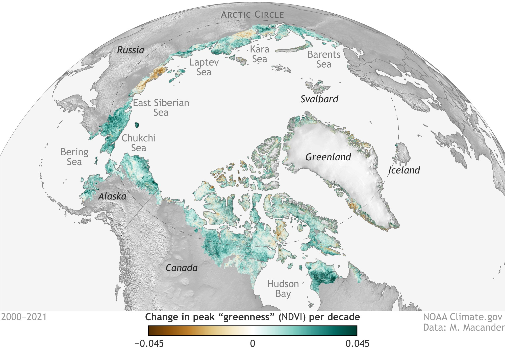
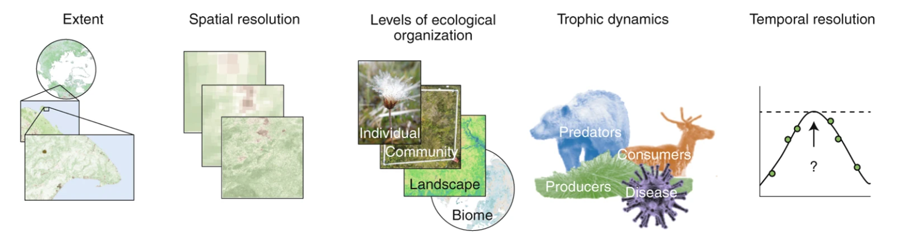

# The Effects of Arctic Greening on the Vitality of the Arctic Biosphere: Public Summary
Group 9: Bronwen Elkins, Jessica Fisher, Jonathan Kan, Kieron Walters
## Introduction
Climate change strongly impacts the Arctic biome, as the Arctic is warming two to four times faster than the rest of the Earth (Evengård et al., 2021; Rantanen et al., 2022). This phenomenon is known as Arctic amplification, which affects the extent of ocean warming, sea ice, land area, snow cover, sea level, and atmospheric circulation (Yamanouchi and Takata, 2020; Chae et al., 2015). Arctic amplification leads to Arctic greening (Figure 1), an increase in plant productivity and biomass at high latitudes (Overland et al., 2019; Phoenix and Treharne, 2022; Yamanouchi and Takata, 2020). Arctic climate change is heavily studied due to the heightened levels of warming and effects on the biome, which drastically modify its environment (Falardeau and Bennett, 2020).

 

**Figure 1:** *The extent of greening in the Arctic Tundra in 2021. The change in peak “greenness” is measured using the normalized difference vegetation index or NDVI, which measures the levels of vegetation. On this map, greening is described with a colour gradient with green indicating greening and brown indicating browning (or the opposite of greening). The darkness of the colour indicates the extent to which greening or browning is occurring (NOAA Climate, 2021).*

## Surface Energy Fluxes
Increases in taller vegetation types are predicted to reduce the reflectivity (albedo) of the Arctic by 7-18% by the 2050s (Pearson et al., 2013). Taller vegetation may produce summer cooling through shading and reduction of insulating snow layers (von Oppen et al., 2022), but increases in winter soil heating of up to 70% are possible (Sturm et al., 2005). Soil heating can increase permafrost thaw, affecting carbon and methane balances (Lawrence and Swenson, 2011; Liang et al., 2018; Kropp et al., 2020). Vegetation increases evapotranspiration, which can redirect surface energy towards the atmosphere through water vapour, increasing regional atmospheric warming (Sellers et al., 1997; Pearson et al., 2013; Nicholls and Carey, 2021).
## Permafrost Thaw
Arctic greening has been shown to contribute to permafrost thaw. Vegetation growth in permafrost soils has been shown to temporarily reduce the depth at which permafrost thaws by 9% (Blok et al., 2010). As Arctic greening is not sustainable on permafrost soils, this benefit is short-lived. In permafrost soils, vegetation is unable to receive the necessary nutrients or room to establish root systems, resulting in increased CO₂ emissions  (Ogden et al., 2023). Additionally, Arctic greening is a negligible carbon sink in comparison to the carbon source of permafrost thaw. Permafrost thaw also introduces the risk of sea level increase, biogeochemical cycle interference, and possibility of accumulation of toxic chemicals (Miner et al., 2021).
## Biodiversity
Arctic greening may affect animal behaviour, species composition, vegetation, and biodiversity in the Arctic (Figure 2) (Vincent et al., 2011; Hirawake et al., 2021). Due to Arctic greening, species that are traditionally found in the South of the Arctic may migrate North, resulting in increased competition for resources, such as food. The Arctic will also contain fewer specialist species, such as polar bears (Vincent et al., 2011). Wildfires may increase the prevalence of fire-favouring species, and pathogens released from the melting ice may devastate Arctic biodiversity (McKenzie et al., 2004; VanWormer et al., 2019). While Arctic greening will increase the biodiversity of the Arctic, existing species in the Arctic may be lost.

**Figure 2:** *The effects of Arctic greening on the Arctic biome can be considered in terms of extent, spatial resolution, temporal resolution, levels of ecological organization and trophic dynamics. Comprehensive studies integrate these many components through both field-based and theoretical models. As the extent of Arctic greening increases (along with decreases in ice and snow cover), organisms will be affected on many different spatial scales from the biome level to the individual level. This will have impacts on the trophic dynamics, affecting the behaviours of animals (predators and consumers) as well as vegetation (producers). Disease will also play a role in affecting which organisms will be able to survive, and therefore, will also affect the species composition in the Arctic. The Arctic biome can also be considered on the temporal level when considering the progression of Arctic greening and its effects throughout time. Many current models are limited by temporal resolution, making it difficult to discern short term effects from long-term trends (Myers-Smith et al., 2020).*

## Conclusion
While short-term benefits to Arctic greening exist, the long-term consequences outweigh them. As global temperatures continue to increase, the state of the Arctic biome will continue to worsen.

## References

Hirawake, T., Uchida, M., Abe, H., Alabia, I.D., Hoshino, T., Masumoto, S., Mori, A.S., Nishioka, J., Nishizawa, B., Ooki, A., Takahashi, A., Tanabe, Y., Tojo, M., Tsuji, M., Ueno, H., Waga, H., Watanabe, Y.Y., Yamaguchi, A. and Yamashita, Y., 2021. Response of Arctic biodiversity and ecosystem to environmental changes: Findings from the ArCS project. *Polar Science*, 27, p.100533. https://doi.org/10.1016/j.polar.2020.100533.

Kropp, H., Loranty, M.M., Natali, S.M., Kholodov, A.L., Rocha, A.V., Myers-Smith, I., Abbot, B.W., Abermann, J., Blanc-Betes, E., Blok, D., Blume-Werry, G., Boike, J., Breen, A.L., Cahoon, S.M.P., Christiansen, C.T., Douglas, T.A., Epstein, H.E., Frost, G.V., Goeckede, M., Høye, T.T., Mamet, S.D., O’Donnell, J.A., Olefeldt, D., Phoenix, G.K., Salmon, V.G., Sannel, A.B.K., Smith, S.L., Sonnentag, O., Vaughn, L.S., Williams, M., Elberling, B., Gough, L., Hjort, J., Lafleur, P.M., Euskirchen, E.S., Heijmans, M.M., Humphreys, E.R., Iwata, H., Jones, B.M., Jorgenson, M.T., Grünberg, I., Kim, Y., Laundre, J., Mauritz, M., Michelsen, A., Schaepman-Strub, G., Tape, K.D., Ueyama, M., Lee, B.-Y., Langley, K. and Lund, M., 2020. Shallow soils are warmer under trees and tall shrubs across Arctic and Boreal ecosystems. *Environmental Research Letters*, 16(1), p.015001. https://doi.org/10.1088/1748-9326/abc994.

Lawrence, D.M. and Swenson, S.C., 2011. Permafrost response to increasing Arctic shrub abundance depends on the relative influence of shrubs on local soil cooling versus large-scale climate warming. *Environmental Research Letters*, 6(4), p.045504. https://doi.org/10.1088/1748-9326/6/4/045504.

Liang, J., Xia, J., Shi, Z., Jiang, L., Ma, S., Lu, X., Mauritz, M., Natali, S.M., Pegoraro, E., Penton, C.R., Plaza, C., Salmon, V.G., Celis, G., Cole, J.R., Konstantinidis, K.T., Tiedje, J.M., Zhou, J., Schuur, E.A.G. and Luo, Y., 2018. Biotic responses buffer warming-induced soil organic carbon loss in Arctic tundra. *Global Change Biology*, 24(10), pp.4946–4959. https://doi.org/10.1111/gcb.14325.

McKenzie, D., Gedalof, Z., Peterson, D.L. and Mote, P., 2004. Climatic Change, Wildfire, and Conservation. *Conservation Biology*, 18(4), pp.890–902. https://doi.org/10.1111/j.1523-1739.2004.00492.x.

Myers-Smith, I.H., Kerby, J.T., Phoenix, G.K., Bjerke, J.W., Epstein, H.E., Assmann, J.J., John, C., Andreu-Hayles, L., Angers-Blondin, S., Beck, P.S.A., Berner, L.T., Bhatt, U.S., Bjorkman, A.D., Blok, D., Bryn, A., Christiansen, C.T., Cornelissen, J.H.C., Cunliffe, A.M., Elmendorf, S.C., Forbes, B.C., Goetz, S.J., Hollister, R.D., de Jong, R., Loranty, M.M., Macias-Fauria, M., Maseyk, K., Normand, S., Olofsson, J., Parker, T.C., Parmentier, F.-J.W., Post, E., Schaepman-Strub, G., Stordal, F., Sullivan, P.F., Thomas, H.J.D., Tømmervik, H., Treharne, R., Tweedie, C.E., Walker, D.A., Wilmking, M. and Wipf, S., 2020. Complexity revealed in the greening of the Arctic. *Nature Climate Change*, 10(2), pp.106–117. https://doi.org/10.1038/s41558-019-0688-1.

Nicholls, E.M. and Carey, S.K., 2021. Evapotranspiration and energy partitioning across a forest-shrub vegetation gradient in a subarctic, alpine catchment. *Journal of Hydrology*, 602, p.126790. https://doi.org/10.1016/j.jhydrol.2021.126790.

NOAA Climate, 2021. *Changes in tundra greenness between 2000 and 2021, based on satellite observations.* [image] Available at: <https://www.climate.gov/media/13886>.

von Oppen, J., Assmann, J.J., Bjorkman, A.D., Treier, U.A., Elberling, B., Nabe-Nielsen, J. and Normand, S., 2022. Cross-scale regulation of seasonal microclimate by vegetation and snow in the Arctic tundra. *Global Change Biology*, 28(24), pp.7296–7312. https://doi.org/10.1111/gcb.16426.

Pearson, R.G., Phillips, S.J., Loranty, M.M., Beck, P.S.A., Damoulas, T., Knight, S.J. and Goetz, S.J., 2013. Shifts in Arctic vegetation and associated feedbacks under climate change. *Nature Climate Change*, 3(7), pp.673–677. https://doi.org/10.1038/nclimate1858.

Sellers, P.J., Dickinson, R.E., Randall, D.A., Betts, A.K., Hall, F.G., Berry, J.A., Collatz, G.J., Denning, A.S., Mooney, H.A., Nobre, C.A., Sato, N., Field, C.B. and Henderson-Sellers, A., 1997. Modeling the Exchanges of Energy, Water, and Carbon Between Continents and the Atmosphere. *Science*, 275(5299), pp.502–509. https://doi.org/10.1126/science.275.5299.502.

Sturm, M., Douglas, T., Racine, C. and Liston, G.E., 2005. Changing snow and shrub conditions affect albedo with global implications. *Journal of Geophysical Research: Biogeosciences*, [online] 110(G1). https://doi.org/10.1029/2005JG000013.

VanWormer, E., Mazet, J. a. K., Hall, A., Gill, V.A., Boveng, P.L., London, J.M., Gelatt, T., Fadely, B.S., Lander, M.E., Sterling, J., Burkanov, V.N., Ream, R.R., Brock, P.M., Rea, L.D., Smith, B.R., Jeffers, A., Henstock, M., Rehberg, M.J., Burek-Huntington, K.A., Cosby, S.L., Hammond, J.A. and Goldstein, T., 2019. Viral emergence in marine mammals in the North Pacific may be linked to Arctic sea ice reduction. *Scientific Reports*, 9(1), p.15569. https://doi.org/10.1038/s41598-019-51699-4.

Vincent, W.F., Callaghan, T.V., Dahl-Jensen, D., Johansson, M., Kovacs, K.M., Michel, C., Prowse, T., Reist, J.D. and Sharp, M., 2011. Ecological Implications of Changes in the Arctic Cryosphere. *Ambio*, 40(Suppl 1), p.87. https://doi.org/10.1007/s13280-011-0218-5.
